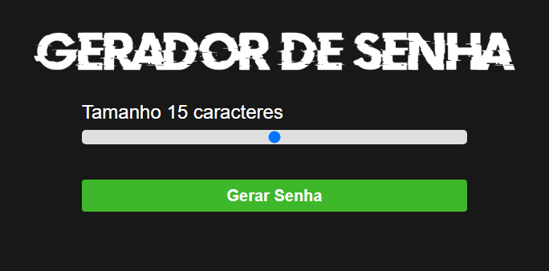

# Gerador-de-Senha

---

## 📝 Descrição

Gerador de Senha é um programa simples que gera senhas aleatorias de acordo com quantidade de caracteres que você quer que Senha tenha.

Esse projeto não é original meu, ele foi desenvolvido pelo [Sujeito Programador](https://www.youtube.com/channel/UCLc5Bq2yfs-S3Zse3ZFRMEQ) e depois publicado no seu canal para ensinar as pessoas a fazerem ele também.

O vídeo é bem explicativo, Então deu para aprender bastante coisa desenvolvendo esse projeto.

Para acessar o Projeto clique [aqui](https://jeanaraga.github.io/Gerador-de-Senha/)

## 📚 Linguagens

- HTML
- CSS
- Javascript

## 🛠 Ferramentas e Sites Auxiliadores

- VSCode
- Github Desktop

## ⚙️ Ajustes e Melhorias 

Futuramente pretendo colocar mais ferramentas,como por exemplo ter a opção se o usuario quer que tenha Letra maiuscula ou não,se que caracteres especiais ou não...

## 👨🏾‍💻 Feito por 

<table>
  <tr>
    <td align="center">
    <a href="#">
         
        
          <b>Jean Pedro</b>
        
      </a>
    </td>
  </tr>
</table>

